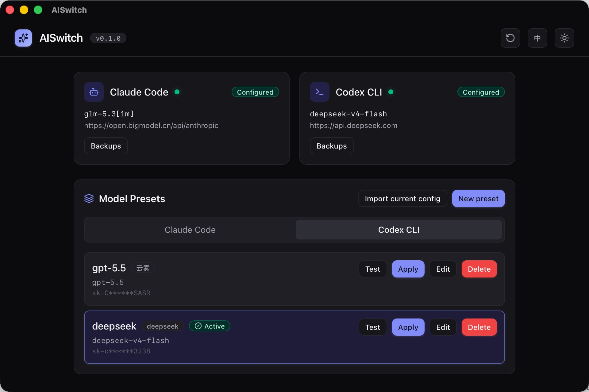

<div align="center">

# AISwitch

**One-click model & provider switching for [Claude Code](https://claude.com/claude-code) and [Codex CLI](https://github.com/openai/codex).**

No more hand-editing `~/.claude/settings.json` or `~/.codex/config.toml`.

[](./LICENSE)
[](https://tauri.app)
[](https://react.dev)
[](#development)

English | [简体中文](./README.zh-CN.md)



</div>

---

## Why

If you switch between the official API and third-party providers (GLM, DeepSeek, Kimi, relay endpoints, …) while coding with Claude Code or Codex CLI, you probably do this several times a day:

1. Open `~/.claude/settings.json` / `~/.codex/config.toml` + `auth.json`
2. Paste a long API key, fix the base URL, pick the model name
3. Hope you didn't break the JSON/TOML

AISwitch turns that into a single click — with validation, backups, and instant rollback.

## Highlights

- 🔒 **Privacy by design** — 100% local. No account, no cloud, no telemetry, no analytics. Your API keys are stored only in `~/.aiswitch/` on your own disk and are sent nowhere except the provider endpoint you explicitly configure.
- 🛡 **Security hardened** — strict CSP, no shell/dialog plugins, owner-only permissions (0600/0700) on every key-bearing file, HTTPS-only network probes (plain HTTP allowed only for loopback), and keys always masked in the UI.
- 🎯 **Does one thing, well** — AISwitch only reads and writes the config files of Claude Code & Codex CLI. No built-in proxy, no request logging, no extra layer between you and your provider. Remove it and your CLI goes back to exactly how it was — that's a feature, see [one-click restore](#features).

## Features

- 🔍 **Auto-detection** — on launch, reads the global config of Claude Code & Codex CLI and shows the currently active provider/model for each (no dependency on CLI being on `PATH`).
- 🗂 **Presets** — save reusable provider profiles (Base URL + API Key + model names). Keys are masked by default; delete requires confirmation; names are unique per tool.
- ⚡ **One-click switch** — writes the target config via temp-file + atomic replace, reads it back to verify, typically under 1 second.
- 🔙 **Automatic backup & rollback** — every write is preceded by a backup; failed writes roll back automatically; restore any backup in one click.
- ♻️ **One-click restore to pre-install state** — a baseline of your configs is captured before the first switch; a three-step dialog (preview → confirm → per-file report) puts every file back exactly as it was, or cleanly removes what AISwitch created. User-owned files and presets are never touched.
- 🧪 **Connectivity test** — probe a preset's endpoint before switching (HTTPS enforced; plain HTTP only for `localhost`/`127.0.0.1`/`[::1]`, so your key can never leak in plaintext).
- 🧩 **Codex `models.json` hosting** — paste a single entry or a whole `models.json`; the file is stored verbatim and family models all appear in the picker. `display_name` is auto-filled when missing.
- 🧩 **Bundle switch** — a bundle combines presets for Claude Code and Codex CLI; one action switches them all in order, each tool with its own backup / rollback / verification.
- 🧰 **Provider templates + local models** — built-in templates for Claude official / OpenAI GPT / GLM / DeepSeek / Kimi / Qwen / Doubao / Ollama / LM Studio; Ollama and LM Studio need no API key.
- ⌨️ **Global shortcuts** — `Cmd/Ctrl+Shift+A` brings the main window to front; `Cmd/Ctrl+Shift+S` cycles to the next preset of the current tool.
- 🖥 **Tray menu** — switch presets straight from the system tray; the active preset is check-marked.
- 🌐 **Bilingual UI** — Chinese & English, following your system language by default with a one-click toggle.
- 🌗 **Light / dark theme** — semantic token theming with a one-click toggle.

## Privacy & Security

AISwitch handles your API keys, so it holds itself to a higher bar:

| Layer      | Guarantee                                                                                                                                                                                                                                                  |
| ---------- | ---------------------------------------------------------------------------------------------------------------------------------------------------------------------------------------------------------------------------------------------------------- |
| Data       | Everything lives on your machine (`~/.aiswitch/`). No account, no sync, no telemetry — nothing to phish or breach.                                                                                                                                         |
| Filesystem | Key-bearing files (`presets.json`, backups, baselines) are restricted to owner-only (0600/0700); the temp file used by atomic writes is restricted _before_ rename, so crash leftovers never leak secrets. Legacy loose permissions are tightened on load. |
| Network    | The only outbound requests are connectivity probes you trigger, and only to `https://` URLs (or plain HTTP on loopback) — validated by a shared rule at both save time and probe time. No proxy, no request interception.                                  |
| App        | Strict CSP (`script-src 'self'` + nonces, `object-src 'none'`, IPC-only `connect-src`); unused plugins (shell, dialog) removed to shrink the attack surface.                                                                                               |
| UI         | Keys are always masked — even short ones are fully hidden, not partially shown.                                                                                                                                                                            |

## Tech Stack

Tauri 2 (thin Rust shell) · React 19 · TypeScript (strict) · Vite · Tailwind CSS v4 · Zustand · TanStack Query · Zod · Vitest

## Development

### Prerequisites

| Item | Requirement                                 |
| ---- | ------------------------------------------- |
| Node | ≥ 20 (24 LTS recommended)                   |
| Rust | ≥ 1.82 (MSVC toolchain required on Windows) |

### Common commands

```bash
pnpm install        # install dependencies (package manager: pnpm)
pnpm desktop:run    # run the desktop app in dev mode
pnpm desktop:build  # compile a Release binary (no installer, fast)
pnpm desktop:bundle # bundle installers (msi/nsis · dmg/app · deb/appimage)
pnpm dev            # frontend-only dev in the browser
pnpm test           # unit tests
pnpm lint           # ESLint (incl. 300-line / 50-line hard limits)
pnpm typecheck      # strict TypeScript check
pnpm icon           # regenerate app icons (scripts/app-icon.png → src-tauri/icons)
```

### Release (GitHub Actions)

1. Bump `version` in both `package.json` and `src-tauri/tauri.conf.json`
2. Commit, then tag & push: `git tag vX.Y.Z && git push origin vX.Y.Z`
3. The [Release workflow](.github/workflows/release.yml) builds all platforms (macOS universal · Windows msi/nsis · Linux deb/appimage) and uploads them to a **draft** GitHub Release — review, then publish

Every push/PR also runs the [CI workflow](.github/workflows/ci.yml): lint / typecheck / tests plus a `cargo check` matrix across macOS, Windows & Linux (platform-conditional code can't be fully verified on a single dev machine).

Installers are currently unsigned. If you downloaded one from [Releases](https://github.com/small-dream/AISwitch/releases):

- **macOS** — after dragging the app into `Applications`, remove the quarantine flag so Gatekeeper lets it open:

  ```bash
  xattr -cr /Applications/AISwitch.app
  ```

- **Windows** — if SmartScreen blocks the installer, click _More info_ → _Run anyway_, or clear the mark of the web first:

  ```powershell
  Unblock-File .\AISwitch_<version>_x64-setup.exe
  ```

- **Linux** — `.deb` / `.rpm` / `.AppImage` install directly without prompts.

## Project Structure

Layered for testability — UI never touches the filesystem directly:

```text
src/ui        → rendering (React components)
src/hooks     → interaction
src/services  → use cases
src/domain    → pure logic (fully unit-tested)
src/adapters  → infrastructure (strategy pattern, one adapter per target CLI)
```

See [docs/ARCHITECTURE.md](docs/ARCHITECTURE.md) for the full tour.

## Documentation

- [docs/PRD.md](docs/PRD.md) — product requirements
- [docs/ARCHITECTURE.md](docs/ARCHITECTURE.md) — architecture & design decisions
- [docs/CODING_STANDARDS.md](docs/CODING_STANDARDS.md) — coding standards & anti-rot rules

## Contributing

Issues and PRs are welcome. For non-trivial changes, please open an issue first to discuss what you'd like to change, and make sure `pnpm lint && pnpm typecheck && pnpm test` passes.

## License

[MIT](./LICENSE) © small-dream
