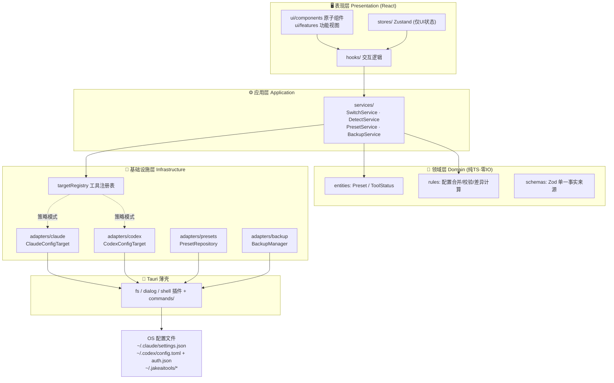
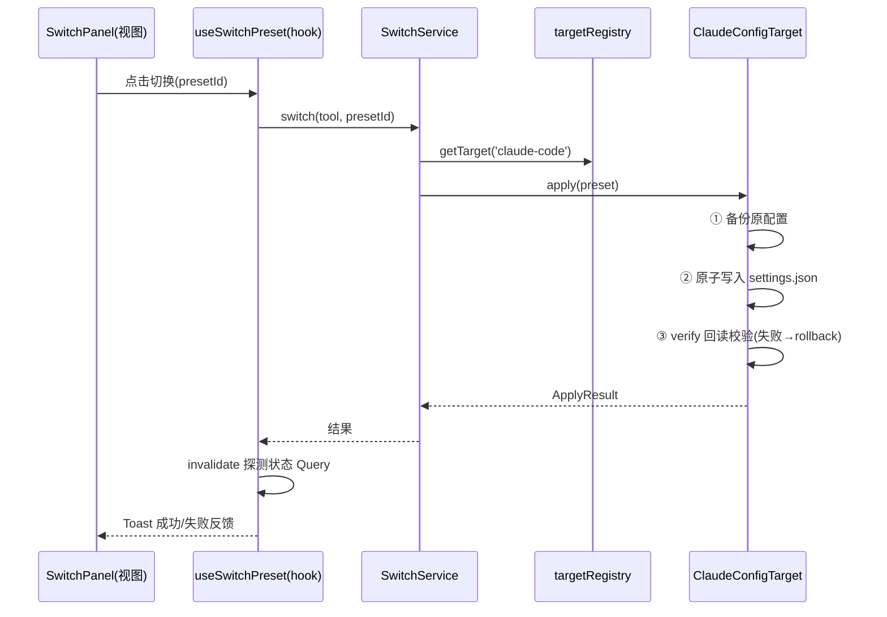

# JakeAITools · 架构设计文档（ARCHITECTURE）

| 项目     | 内容                                                   |
| -------- | ------------------------------------------------------ |
| 文档版本 | v0.1（Phase 1 基线，已评审确认）                       |
| 维护角色 | 首席架构师 / Tech Lead                                 |
| 同步要求 | **活文档**：架构或选型变更必须先更新本文档，再进入开发 |

---

## 1. 技术选型与理由

| 层            | 选型                                            | 选择理由（AI 友好视角）                                                                                                                      |
| ------------- | ----------------------------------------------- | -------------------------------------------------------------------------------------------------------------------------------------------- |
| 桌面框架      | **Tauri 2**                                     | 包体 ~10MB、内存占用低、跨平台、安全模型好；**Rust 层保持极薄**（优先官方插件，仅特权操作），95% 代码在 TS 层——AI 高频修改的只有一个语言体系 |
| 前端          | **React 19 + TypeScript(strict) + Vite**        | 语料最丰富的生态，AI 生成准确率最高；strict 类型系统是「可执行的规格说明」，重构有编译器兜底                                                 |
| 样式          | **Tailwind CSS v4**                             | 原子类即改即生效，无命名冲突，AI 修改 UI 不易引发连锁错误                                                                                    |
| 客户端状态    | **Zustand**                                     | API 极简、零样板，天然按 store 切片成小文件                                                                                                  |
| 磁盘/异步数据 | **TanStack Query**                              | 预设列表、探测结果等「来自文件系统的服务端状态」统一缓存 / 重试 / 失效范式                                                                   |
| 表单与校验    | **React Hook Form + Zod**                       | Zod Schema 是配置结构的**单一事实来源**，同时服务运行时校验与类型推导                                                                        |
| 配置解析      | `smol-toml` + 原生 JSON                         | Claude（JSON）/ Codex（TOML）各有专职解析器                                                                                                  |
| 数据存储      | 用户目录下 Zod 校验的 JSON 文件                 | 该量级无需数据库；经 Repository 接口抽象，未来可无痛换 SQLite                                                                                |
| 质量工具      | ESLint(strict-type-checked) + Prettier + Vitest | 静态防线 + 单测双保险；红线规则见 `CODING_STANDARDS.md`                                                                                      |

## 2. 分层架构

### 2.1 架构图



### 2.2 分层职责与依赖规则

| 层           | 职责                                 | 允许依赖                              | 禁止                                        |
| ------------ | ------------------------------------ | ------------------------------------- | ------------------------------------------- |
| `ui/`        | 纯渲染（props 进、事件出）           | hooks、stores、原子组件               | 直接 import adapters / services / Tauri API |
| `hooks/`     | 交互逻辑、连接 services 与视图       | services、stores、types               | 直接操作文件 / Tauri API                    |
| `services/`  | 用例编排（切换、探测、备份流程）     | domain、types（接口）、targetRegistry | import 具体 adapter 实现类                  |
| `domain/`    | 实体、纯业务规则、Zod Schema         | 仅 zod（零 IO、零框架）               | 依赖任何上层或 Tauri                        |
| `adapters/`  | 接口实现（读写配置、预设存储、备份） | domain、types、Tauri API              | 被 ui 直接引用                              |
| `src-tauri/` | 特权操作薄壳，逐命令拆分小文件       | tauri 及官方插件                      | 业务逻辑（一律上移 TS 层）                  |

数据流向固定单向：`UI → hooks → services → domain/adapters → 回调刷新 → UI`。

### 2.3 关键设计决策

**D1 · ConfigTarget 策略 + 注册表（核心扩展点）**

```ts
// src/types/config-target.ts —— 所有目标工具的统一契约
export interface ConfigTarget {
  readonly tool: TargetTool
  detect(): Promise<ToolStatus>
  apply(preset: Preset): Promise<ApplyResult> // 备份→写入→校验 三段式
  verify(preset: Preset): Promise<boolean>
  rollback(): Promise<void>
}
```

新增一个 CLI 工具支持 = `adapters/<tool>/` 新目录 + 注册一行，**零修改既有代码**（严格 OCP）。

**D2 · Zod 单一事实来源**：`domain/schemas/` 中的 Schema 同时承担「运行时校验（读写配置文件的第一道防线）」与「类型推导（`z.infer`）」。

**D3 · FileSystemPort 依赖倒置**：adapter 依赖注入的文件系统接口（而非直接调 Tauri API），单测注入内存替身即可覆盖。

**D4 · 写入三段式**：`apply = backup → 原子写（临时文件+替换）→ verify`，任一步失败自动 rollback。

**D5 · Rust 薄壳原则**：优先使用官方 fs/dialog/shell 插件；确需自定义命令时按组放入 `src-tauri/src/commands/`，每命令组一个小文件，逻辑保持 ≤ 20 行。

**D6 · 托盘数据流（US-08）**：业务数据仅存 TS 侧——前端经 `tray_update` 命令推送预设快照、Rust（`src-tauri/src/tray.rs`）只做菜单装配；托盘点击经 `tray://switch` 事件回到前端，复用 `SwitchService` 单一切换链路。Rust 不持有业务状态，切换语义与主窗口完全一致。

**D7 · 主题令牌体系（US-15）**：UI 一律使用语义工具类（`bg-app-*` / `text-app-*` / `border-app-*`，定义于 `src/styles/global.css` 的 `@theme`），**禁止硬编码 zinc-_/emerald-_ 等色值**（StatusDot 等双主题通用色除外）；暗色主题通过 `.dark` 作用域整体覆盖同名变量实现，主题选择持久化于 localStorage 并在首帧前应用（防闪烁）。

## 3. 目录结构

```text
JakeAITools/
├── docs/                        # 三活文档：PRD / ARCHITECTURE / CODING_STANDARDS
├── scripts/                     # 工程脚本（图标生成等）
├── src-tauri/                   # Rust 薄壳（保持极薄）
│   ├── src/
│   │   ├── main.rs              # ≤20 行，仅装配
│   │   ├── lib.rs               # 注册插件与命令
│   │   └── commands/            # 每个特权操作一个小文件
│   ├── capabilities/            # Tauri 权限声明（最小权限）
│   └── icons/
├── src/
│   ├── app/                     # 应用装配：入口、Providers、ErrorBoundary
│   ├── ui/
│   │   ├── components/          # 原子组件（一组件一文件，≤150 行）
│   │   ├── features/            # 功能视图：preset-manage / switch-panel / backup
│   │   └── layouts/
│   ├── hooks/                   # 跨功能复用的自定义 hooks
│   ├── services/                # 应用服务：switch / detect / preset / backup
│   ├── domain/
│   │   ├── entities/            # Preset、ToolStatus 类型与不变式
│   │   ├── rules/               # 纯函数：merge-config / diff-config / validate
│   │   └── schemas/             # Zod：claude-config / codex-config / preset
│   ├── adapters/
│   │   ├── claude/              # reader.ts / writer.ts / transformer.ts
│   │   ├── codex/               # 同上结构，TOML 专属逻辑隔离于此
│   │   ├── presets/             # PresetRepository（JSON 存储）
│   │   ├── backup/              # BackupManager
│   │   └── target-registry.ts   # ConfigTarget 注册表
│   ├── stores/                  # Zustand：ui-store / theme-store（按域切片）
│   ├── types/                   # 跨层共享接口（ConfigTarget 等）
│   ├── utils/                   # 无状态纯工具
│   └── constants/               # 错误码、路径、枚举
└── tests/                       # 单测镜像 src 结构；fixtures/ 放真实配置样本
```

> 目录即架构：每个 adapter 内部强制再拆 reader / writer / transformer，任何文件想膨胀到 300 行以上都没有物理空间。

## 4. 状态管理与数据流

| 状态类别                        | 归属地                          | 禁止事项                  |
| ------------------------------- | ------------------------------- | ------------------------- |
| 磁盘/环境数据（预设、探测结果） | TanStack Query + Service        | 复制进全局 store 造成双源 |
| 全局 UI 状态（当前 Tab、主题）  | Zustand（按域切片）             | store 里放业务函数        |
| 局部交互/表单状态               | 组件 useState / React Hook Form | 局部状态提升为全局        |

「一键切换」时序（示例）：



## 5. 错误处理架构

- 统一错误类型 `AppError { code, message, context }`，错误码枚举分域见 `src/constants/error-codes.ts`；
- 分层职责：**Adapter 抛**带上下文的 AppError → **Service 包装/转换** → **UI 层统一拦截**（全局 ErrorBoundary + Toast）；
- 任何层禁止吞错、禁止裸 `try-catch`；详见 `CODING_STANDARDS.md` §6。

## 6. 测试策略

| 层级                   | 手段                                              | 目标             |
| ---------------------- | ------------------------------------------------- | ---------------- |
| domain/rules（纯函数） | Vitest 单测，零 mock                              | 覆盖率 ≥ 90%     |
| services               | Vitest + 注入替身（假 target / 假 repo）          | 覆盖率 ≥ 90%     |
| adapters               | `tests/fixtures/` 真实配置样本做 golden-file 快照 | 全部读写路径覆盖 |
| ui                     | Testing Library 行为测试                          | 关键交互路径     |

## 7. 安全模型

1. **最小权限**：fs 读写仅限 `~/.claude`、`~/.codex`、`~/.jakeaitools` 三目录；`~/.vscode*` 目录仅开放 exists / read-dir（插件迹象探测，只读）；连通性测试经 tauri-plugin-http，因供应商地址由用户预设决定，scope 放开 `https://**` / `http://**`；
2. **API Key**：仅本地存储（v0.1 JSON + 收紧文件权限；v0.2 评估 OS Keychain，见 PRD §7.3）；
3. **CSP**：当前开发期为 null，发布前必须配置严格 CSP（记入发布检查单）。

## 8. 环境要求与开发命令

| 项     | 要求                              |
| ------ | --------------------------------- |
| Node   | ≥ 20（推荐 24 LTS）               |
| Rust   | ≥ 1.82（MSVC 工具链，Windows）    |
| 包管理 | pnpm（依赖锁定于 pnpm-lock.yaml） |

```bash
pnpm install        # 安装依赖
pnpm dev            # 前端开发服务器（纯 Web 调试）
pnpm desktop:run    # 桌面应用开发模式（跨平台封装）
pnpm desktop:build  # 编译桌面 Release 二进制（不打包安装器）
pnpm desktop:bundle # 打包各平台安装器
pnpm test           # 单元测试
pnpm lint           # ESLint（含红线规则）
pnpm typecheck      # TypeScript 严格检查
```

## 9. 扩展指南：新增一个目标工具（以 Gemini CLI 为例）

1. `src/domain/schemas/gemini-config.ts`：定义其配置 Schema（Zod 单一事实来源）；
2. `src/adapters/gemini/`：新建 `reader.ts` / `writer.ts` / `transformer.ts` / `index.ts`（实现 `ConfigTarget`）；
3. `src/adapters/gemini/index.ts` 末尾调用 `registerTarget(...)` 完成注册；
4. `src/constants/` 中扩展工具枚举与展示元数据；
5. `tests/fixtures/gemini/` 放真实配置样本 + 完成单测；
6. 同步更新本文档与 `PRD.md`。

既有 claude / codex 代码**零修改**。

## 10. 决策记录（ADR）

| 编号    | 决策                                | 理由与代价                                                                       |
| ------- | ----------------------------------- | -------------------------------------------------------------------------------- |
| ADR-001 | Tauri 2 而非 Electron               | 包体/内存/安全全面占优；接受 Rust 心智成本，以「薄壳原则」缓解                   |
| ADR-002 | JSON 文件存储而非 SQLite            | 量级小、可读可 diff；Repository 接口保留未来替换权                               |
| ADR-003 | Zustand + TanStack Query 而非 Redux | 低样板，边界清晰（UI 状态 vs 服务端状态）                                        |
| ADR-004 | Tailwind CSS v4                     | 原子化 + CSS-first 配置，AI 修改安全性高                                         |
| ADR-005 | 依赖策略：全部使用最新稳定版        | 安装时解析 latest，`npm outdated` 复核，锁文件锁定                               |
| ADR-006 | TypeScript 锁定 6.x（暂不升 7.0）   | TS 7.0 为原生编译器（无 JS API），typescript-eslint 生态尚未支持；待其支持后升级 |
