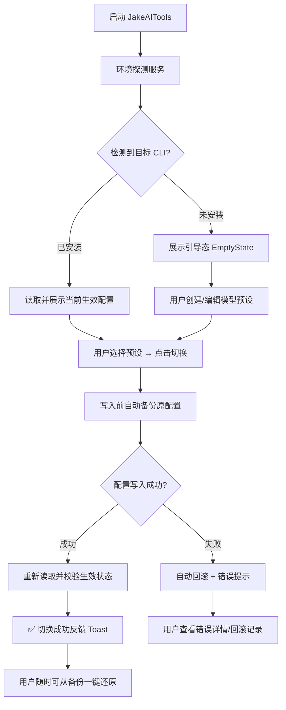

# JakeAITools · 产品需求文档（PRD）

| 项目     | 内容                                                 |
| -------- | ---------------------------------------------------- |
| 产品名称 | JakeAITools                                          |
| 文档版本 | v0.1（Phase 1 基线，已评审确认）                     |
| 维护角色 | 产品经理（PM）                                       |
| 同步要求 | **活文档**：任何功能变更必须先更新本文档，再进入开发 |

---

## 1. 产品概述

### 1.1 一句话定位

> JakeAITools 是一款跨平台（Windows / macOS / Linux）桌面工具，让开发者**一键切换 Claude Code 与 Codex CLI 的全局模型/供应商配置**，彻底告别手工编辑配置文件。

### 1.2 背景与痛点

1. AI Coding 重度用户经常在官方 API 与第三方供应商（GLM、DeepSeek、Kimi、各类中转站）之间高频切换；
2. 每次切换需手改 `~/.claude/settings.json`、`~/.codex/config.toml` + `auth.json`，粘贴长 API Key，繁琐且易错；
3. 配置无备份、无版本，写坏后难以回溯；切换后是否生效缺乏即时反馈。

### 1.3 目标受众

| 画像     | 描述                                         | 核心诉求                 |
| -------- | -------------------------------------------- | ------------------------ |
| 主力用户 | 同时使用 Claude Code / Codex CLI 的开发者    | 秒级切换，不碰配置文件   |
| 次要用户 | 经由第三方中转 / 多供应商使用上述 CLI 的用户 | 预设复用、Key 管理、防呆 |

### 1.4 非目标（Non-Goals）

- 不做 API Key 的云端同步 / 团队权限管理（P2 仅做文件导入导出）；
- 不修改 CLI 内部行为，仅管理其**官方配置文件**；
- 不做模型对话 / 调试客户端。

## 2. 术语表

| 术语                   | 定义                                                        |
| ---------------------- | ----------------------------------------------------------- |
| 目标工具（Target）     | 被管理的 CLI：Claude Code、Codex CLI                        |
| 预设（Preset）         | 一套可复用的供应商配置档案（Base URL + API Key + 模型名等） |
| 供应商（Provider）     | 模型服务提供方：官方 API、GLM、DeepSeek、中转站等           |
| 切换（Switch / Apply） | 将某预设写入目标工具全局配置的动作                          |
| 回滚（Rollback）       | 从备份恢复上一次配置                                        |

## 3. 用户故事与优先级

### 3.1 P0（MVP 功能闭环）

| ID    | 用户故事                                                                      | 验收标准                                                                                                                                                                                                                                           |
| ----- | ----------------------------------------------------------------------------- | -------------------------------------------------------------------------------------------------------------------------------------------------------------------------------------------------------------------------------------------------- |
| US-01 | 作为用户，启动时自动**探测**本机 Claude Code / Codex 的全局配置与当前生效模型 | ① 三态：未检测到配置 / 已配置（显示当前供应商与模型）/ 未知（配置存在但无法解析，给出警告）；② 启动后 3 秒内完成探测；③ **探测仅基于全局配置文件，不依赖终端 CLI / PATH 存在性**——VS Code 插件形态使用时同样正确识别，且切换入口在任何状态下都可用 |
| US-02 | 作为用户，我可以对「模型预设」做**增删改查**                                  | ① 字段与校验见 §5.2；② API Key 默认遮蔽显示，可切换明文；③ 删除需二次确认；④ 同一工具内预设名唯一                                                                                                                                                  |
| US-03 | 作为用户，选中预设后**一键切换**，程序自动写入对应配置文件                    | ① 写入映射见 §5.1；② 写入采用「临时文件 + 原子替换」；③ 写后回读校验生效；④ 全程 ≤ 1 秒                                                                                                                                                            |
| US-04 | 作为用户，每次写入前**自动备份**原配置，可一键回滚                            | ① 备份策略见 §5.4；② 写入失败自动回滚并提示错误详情；③ 可一键恢复最近一份备份                                                                                                                                                                      |
| US-05 | 作为用户，首页清晰展示**两个工具当前激活**的供应商/模型                       | 状态点 + 供应商名 + 模型名；探测数据实时刷新                                                                                                                                                                                                       |

### 3.2 P1（体验增强）

> 实施状态（2026-08-14）：**US-06 / US-07 / US-08 / US-10 / US-14 / US-15 已交付**；US-09（CLI）排期下一迭代。

| ID    | 用户故事                                     | 说明                                                                                    |
| ----- | -------------------------------------------- | --------------------------------------------------------------------------------------- |
| US-06 | 切换前可**测试连通性**（API Key 有效性预检） | 发送一次最小化请求，超时 10s，结果内联展示                                              |
| US-08 | **系统托盘**常驻 + 托盘菜单快捷切换          | 免开主窗口完成高频切换                                                                  |
| US-09 | **CLI 模式**（如 `jake use claude glm-4.6`） | 供终端党使用，与 GUI 共享同一份预设                                                     |
| US-10 | **备份历史**列表管理                         | 查看 / 恢复 / 清理历史备份                                                              |
| US-14 | **VS Code 插件安装迹象检测**增强提示         | 检测 `~/.vscode/extensions` 下对应插件目录，未配置状态下展示「检测到 VS Code 插件」提示 |
| US-15 | **亮 / 暗双主题**一键切换（设计规范承诺项）  | 语义色彩令牌体系；选择持久化于 localStorage，启动首帧前应用防闪烁                       |

### 3.3 P2（远期规划）

| ID    | 说明                                                                            |
| ----- | ------------------------------------------------------------------------------- |
| US-11 | 支持更多目标工具（Gemini CLI、Cursor 等）——依赖「适配器注册表」架构，零侵入扩展 |
| US-12 | 预设导入 / 导出（JSON 文件，团队共享）                                          |
| US-13 | 英文界面（i18n）                                                                |

## 4. 核心业务流程

### 4.1 主链路

## 5. 功能需求明细（P0）

### 5.1 配置写入映射

**表 A · Claude Code**（写入 `~/.claude/settings.json` 的 `env` 字段）：

| 配置键                       | 来源                    | 规则                       |
| ---------------------------- | ----------------------- | -------------------------- |
| `ANTHROPIC_BASE_URL`         | `preset.baseUrl`        | 为空（官方）时**删除该键** |
| `ANTHROPIC_AUTH_TOKEN`       | `preset.apiKey`         | —                          |
| `ANTHROPIC_MODEL`            | `preset.model`          | —                          |
| `ANTHROPIC_SMALL_FAST_MODEL` | `preset.smallFastModel` | 为空时删除该键             |

规则：仅覆盖上表所列键，**保留文件中其余未知字段**（防止抹掉用户其他配置）。

**槽位映射兼容**：第三方中转常见用法是不写 `ANTHROPIC_MODEL`，而以 `ANTHROPIC_DEFAULT_SONNET/OPUS/HAIKU_MODEL` 三槽位映射实际模型。当检测到任一槽位键时视为「槽位映射模式」：切换将同步覆盖三槽位（SONNET/OPUS = 模型，HAIKU = 小模型或主模型），否则切换对该类配置不生效；导入与探测的模型读取链为 `ANTHROPIC_MODEL → 槽位键 → 顶层 model`。

**表 B · Codex CLI**（写入 `~/.codex/config.toml` 与 `~/.codex/auth.json`）：

| 文件          | 配置键                                                     | 来源             | 规则                                                   |
| ------------- | ---------------------------------------------------------- | ---------------- | ------------------------------------------------------ |
| `config.toml` | 顶层 `model`                                               | `preset.model`   | —                                                      |
| `config.toml` | 顶层 `model_provider`                                      | —                | 官方 → `"openai"`；第三方 → 注入的 `"jake_current"` 块 |
| `config.toml` | `[model_providers.jake_current].base_url`                  | `preset.baseUrl` | 第三方时写入；切回官方时移除该块                       |
| `config.toml` | `[model_providers.jake_current].experimental_bearer_token` | `preset.apiKey`  | 第三方时同步写入（DeepSeek 官方脚本模式）              |
| `auth.json`   | `OPENAI_API_KEY`                                           | `preset.apiKey`  | 始终写入（官方模式），与块内 token 双通道兼容          |

**Codex 读取语义（导入/探测）**：供应商 = `model_provider` 指向的 `[model_providers.<id>]` 块（不猜测其他块）；供应商展示名优先块内 `name`；**Key 读取链 = 块内 `experimental_bearer_token` → `auth.json` 的 `OPENAI_API_KEY`**（DeepSeek 官方安装脚本将 Key 内嵌于 provider 块）。

### 5.2 预设字段定义

| 字段                      | 类型     | 必填     | 校验规则                       |
| ------------------------- | -------- | -------- | ------------------------------ |
| `id`                      | string   | 系统生成 | UUID，不可变                   |
| `name`                    | string   | 是       | 1–50 字符，同一工具内唯一      |
| `tool`                    | enum     | 是       | `claude-code` \| `codex`       |
| `providerName`            | string   | 是       | 1–50 字符（如 GLM / 中转站名） |
| `baseUrl`                 | string   | 否       | 合法 URL；**留空 = 官方 API**  |
| `apiKey`                  | string   | 是       | 非空                           |
| `model`                   | string   | 是       | 1–100 字符                     |
| `smallFastModel`          | string   | 否       | 仅 claude-code 使用            |
| `createdAt` / `updatedAt` | ISO 8601 | 系统维护 | —                              |

### 5.3 预设存储

- 位置：`~/.jakeaitools/presets.json`（结构 `{"version": 1, "presets": [...]}`）；
- 读写必须经 Zod Schema 校验（见 `ARCHITECTURE.md` §2.3）；
- API Key 安全路线见 §7.3。

### 5.4 备份与回滚策略

1. 每次写入前：将原文件复制至 `~/.jakeaitools/backups/<tool>/<yyyyMMdd-HHmmss>.<json|toml>`；
2. 每个工具**保留最近 20 份**，超出滚动清理；
3. 写入采用「临时文件 + 原子替换」，任何一步失败不得损坏原配置；
4. 写后回读校验（verify），失败自动回滚；
5. P0 提供「一键恢复最近一份」；备份历史列表管理在 P1（US-10）。

### 5.5 探测规则

**语义基线：探测针对「全局配置」，而非「CLI 是否安装」。**
Claude Code 与 Codex 均支持 VS Code 插件形态使用（终端可能没有 CLI），但插件与 CLI 读写**同一套全局配置文件**；因此「未检测到配置」不能推断为「未安装工具」。

| 工具        | 已配置（installed）            | 当前配置来源                    | 解析失败                  |
| ----------- | ------------------------------ | ------------------------------- | ------------------------- |
| Claude Code | 存在 `~/.claude/settings.json` | `env` 字段各键                  | 状态置为 `unknown` 并警告 |
| Codex CLI   | 存在 `~/.codex/config.toml`    | 顶层 `model` / `model_provider` | 状态置为 `unknown` 并警告 |

- 均不存在 → `not-configured`（展示「未检测到全局配置」提示：首次切换将自动创建配置，VS Code 插件方式同样生效）；
- **切换能力不依赖探测结果**：`not-configured` 状态下应用预设即首次创建全局配置（有单测覆盖）；
- 插件安装迹象检测（US-14）为 P1 增强，不改变上述语义。

### 5.6 连通性测试规则（US-06）

- **请求方式**：GET models 端点——Claude/Anthropic 风格 `{base}/v1/models`；Codex/OpenAI 风格在 base 已含 `/v1` 时 `{base}/models`、否则自动补齐；官方预设（无 baseUrl）使用官方基址（api.anthropic.com / api.openai.com/v1）；
- **鉴权头**：`Authorization: Bearer`；Claude 额外携带 `x-api-key` 与 `anthropic-version: 2023-06-01` 以兼容官方与中转站；
- **超时** 10s（AbortSignal）；
- **结果归档**：2xx → ok（含耗时）；401/403 → Key 无效；404/405 → 供应商不支持探测；其余状态码/网络异常 → 无法连通；
- **定位**：最佳努力预检，**不阻断切换**；部分中转站未实现 models 端点（归为 unsupported），提示直接切换验证；
- **网络通道**：Tauri http 插件（绕过 WebView CORS 限制）。

### 5.7 托盘与常驻（US-08）

- **常驻**：关闭主窗口仅隐藏至托盘，退出仅经托盘菜单「退出」；
- **单实例**：重复启动应用时唤起已有主窗口（提前落地 PRD §7.4）；
- **菜单结构**：各工具分区（子菜单列出该工具预设，空分区显示「暂无预设」）＋ 显示主窗口 ＋ 退出；
- **快捷切换**：托盘点选预设后复用与主窗口完全相同的切换链路（同一 SwitchService，含备份与自动回滚），结果以**系统通知**反馈，不强制打开主窗口；
- **菜单数据源**：业务数据仅存 TS 侧，预设变化时由前端推送快照重建菜单，Rust 不持有业务状态。

## 6. 非功能需求

| 类别   | 要求                                                                      |
| ------ | ------------------------------------------------------------------------- |
| 性能   | 启动 ≤ 2s；切换端到端 ≤ 1s；空闲内存 ≤ 150MB                              |
| 兼容性 | Windows 10+ / macOS 12+ / 主流 Linux；Claude Code、Codex CLI 当前主流版本 |
| 可靠性 | 任何写入失败不得损坏原配置（原子写 + 备份先行）                           |
| 安全   | 见 §7.3                                                                   |
| 语言   | v0.1 中文优先，i18n 在 P2                                                 |

## 7. 边界、约束与风险

| 编号 | 风险 / 约束                             | 缓解策略                                                                                     |
| ---- | --------------------------------------- | -------------------------------------------------------------------------------------------- |
| 7.1  | 上游 CLI 配置 Schema 漂移（官方改字段） | Zod 宽松解析 + 保留未知字段 + 备份兜底 + 写后校验                                            |
| 7.2  | 用户在本软件之外并发手改配置            | 写入前重读并 diff，提示「外部已变更，是否覆盖」                                              |
| 7.3  | API Key 本地明文存储风险                | 路线：v0.1 本地 JSON + 收紧文件权限；v0.2 评估接入 OS Keychain（Tauri stronghold / keyring） |
| 7.4  | 多实例同时写配置                        | P1 引入单实例锁                                                                              |
